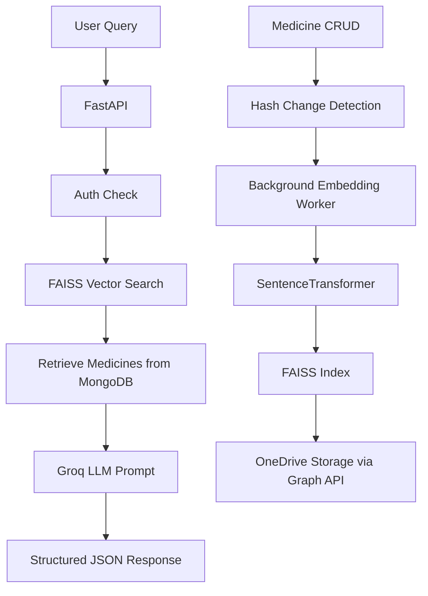

# Aushadhi 360 - AI-Powered Personal Medicine Assistant (RAG System)

[](https://fastapi.tiangolo.com)
[](https://www.python.org)
[](https://www.mongodb.com)

**An intelligent AI Doctor with Retrieval-Augmented Generation (RAG) for personalized medicine recommendations.**

Aushadhi 360 is a secure, per-user FastAPI backend that acts as your personal AI medical assistant. It uses **vector embeddings + FAISS** to retrieve relevant medicines from your private collection and **Groq LLM** to generate contextual instructions, dosages, and guidance.

---

## ✨ Features

### 🔐 Secure Per-User System
- Email/password authentication
- Isolated medicine database per user
- Private FAISS embeddings stored securely in OneDrive (Microsoft Graph API)

### 🧠 Intelligent RAG Pipeline
- **Embedding Model**: `intfloat/multilingual-e5-base` (supports English + Hinglish)
- Automatic embedding generation on medicine changes (SHA256 hash detection)
- Versioned FAISS indexes (`faiss_v1.index`, `faiss_v2.index`, ...)
- Background worker for efficient updates

### 💊 Smart Medicine Search & AI Guidance
- Natural language queries (e.g., "fever and cough", "stomach pain after eating")
- Retrieves top-k similar medicines using cosine/L2 similarity
- LLM generates structured JSON response with:
  - AI Response explanation
  - Recommended medicines with S.no, Name, Batch_ID, Description, Quantity, **Instructions**
  - Overall score and safety notes
- Robust fallback system when LLM fails

### 📊 Admin & Monitoring
- Real-time embedding status API
- Manual rebuild trigger
- Change detection to avoid unnecessary computations

---

## 🏗️ Architecture



**Data Flow**:
1. User logs in → Triggers embedding build if needed
2. Medicines stored in MongoDB (`medicines` collection)
3. Text fields (Disease, Symptoms, Side Effects, Hinglish Description) are embedded
4. Query → Encoded → FAISS search → Top matches → LLM reasoning → Instructions

---

## 🛠️ Tech Stack

- **Backend**: FastAPI + Uvicorn
- **Database**: MongoDB (with indexes)
- **Vector Search**: FAISS + SentenceTransformers
- **LLM**: Groq (Llama 3.3 70B)
- **Storage**: Microsoft OneDrive (Graph API - App-only auth)
- **Others**: pandas, numpy, dotenv, pymongo, background tasks

---

## 📋 Prerequisites

- Python 3.10+
- MongoDB Atlas (or local)
- Microsoft Azure App Registration (for OneDrive Graph API)
- Groq API Key (per user)

---

## 🚀 Installation & Setup

1. **Clone the repository**
   ```bash
   git clone https://github.com/yourusername/aushadhi360.git
   cd aushadhi360
   ```

2. **Install dependencies**
   ```bash
   pip install -r requirements.txt
   ```

3. **Create `.env` file** (see Environment Variables below)

4. **Run the server**
   ```bash
   python main.py
   ```

   Or with Uvicorn:
   ```bash
   uvicorn main:app --host 0.0.0.0 --port 8000 --reload
   ```

---

## 🔑 Environment Variables

| Variable                  | Description                                      | Required |
|--------------------------|--------------------------------------------------|----------|
| `DATABASE_URL`           | MongoDB connection string                        | Yes     |
| `AZURE_TENANT_ID`        | Azure Tenant ID                                  | Yes     |
| `AZURE_CLIENT_ID`        | Azure App Client ID                              | Yes     |
| `AZURE_CLIENT_SECRET`    | Azure App Client Secret                          | Yes     |
| `GRAPH_TOKEN_URL`        | Microsoft Graph token endpoint                   | Yes     |
| `ONEDRIVE_DRIVE_ID`      | OneDrive Drive ID                                | Yes     |
| `ONEDRIVE_ROOT_FOLDER`   | Root folder name (default: `OCD360_Embeddings`) | No      |
| (User-level) `groqKeyAssist` | Groq API key stored in user document          | Yes     |

---

## 📡 API Endpoints

### Authentication & Status
- `POST /login` - Login + check embedding status
- `GET /embeddings/status/{user_id}` - Get embedding build status

### Medicine Management
- `POST /embeddings/rebuild/{user_id}` - Trigger embedding rebuild

### Main Query
- `GET /get_medicines?query=...&mail=...&password=...` - **Core AI Doctor endpoint**

**Example Query**:
```
GET /get_medicines?query=fever and dry cough&mail=user@example.com&password=xxx
```

**Response Structure**:
```json
{
  "AI Response": "For fever and cough, I recommend...",
  "Medicines": [
    {
      "S.no": 1,
      "Name of Medicine": "Paracetamol",
      "Batch_ID": "B123",
      "Description": "...",
      "Quantity": "10 tabs",
      "Instructions": "Take 1 tablet every 6 hours..."
    }
  ],
  "Score": "85%",
  "overall instructions": "Consult doctor if symptoms persist..."
}
```

---

## 🔄 How Embeddings Work

1. **Change Detection**: Computes SHA256 of all user medicines
2. **Text Preparation**: Combines `Cover Disease || Symptoms || Side Effects || Description in Hinglish`
3. **Embedding**: `multilingual-e5-base`
4. **Storage**: Versioned FAISS index uploaded to user's private OneDrive folder
5. **Retrieval**: Downloads latest index on query → searches → merges with MongoDB data

---

## 🧪 Usage Flow (From User Interaction to Medicine Instructions)

1. **User registers** medicines in the system (via separate frontend/CRUD)
2. **Login** → System checks embeddings
3. **If needed** → Background worker builds/updates FAISS index
4. **User asks** natural language question
5. **System** retrieves top similar medicines using vector similarity
6. **LLM** receives medicines + query → generates safe, structured instructions
7. **User receives** personalized AI guidance with clear dosage/instructions

**Safety Note**: Always include "Consult a doctor" disclaimers. This is an assistive tool, not a replacement for professional medical advice.

---

## 📁 Project Structure

```
aushadhi360/
├── main.py                 # Main FastAPI application
├── requirements.txt
├── .env.example
├── README.md
└── (temp files handled automatically)
```

---

## 🛡️ Security Considerations

- Per-user data isolation
- Credentials never logged
- OneDrive uses app-only authentication
- Passwords stored (consider hashing in production)
- Rate limiting recommended for production

---

## 🚀 Deployment

- **Render / Railway / Fly.io** (FastAPI friendly)
- **Docker** support recommended
- MongoDB Atlas + Azure for production

---

## 🤝 Contributing

Contributions welcome! Please open issues or PRs for:
- Better prompting strategies
- Multi-language improvements
- Frontend integration
- Caching optimizations

---

## 📄 License

MIT License - see [LICENSE](LICENSE) file.

---

**Built with ❤️ for better healthcare accessibility.**

*Disclaimer: This project is for educational and assistive purposes. Always consult qualified healthcare professionals for medical decisions.*

```

---

**Note**: Replace placeholder links (GitHub URL, etc.) with your actual repo details. Let me know if you want a `requirements.txt`, `.env.example`, or Docker setup added!
